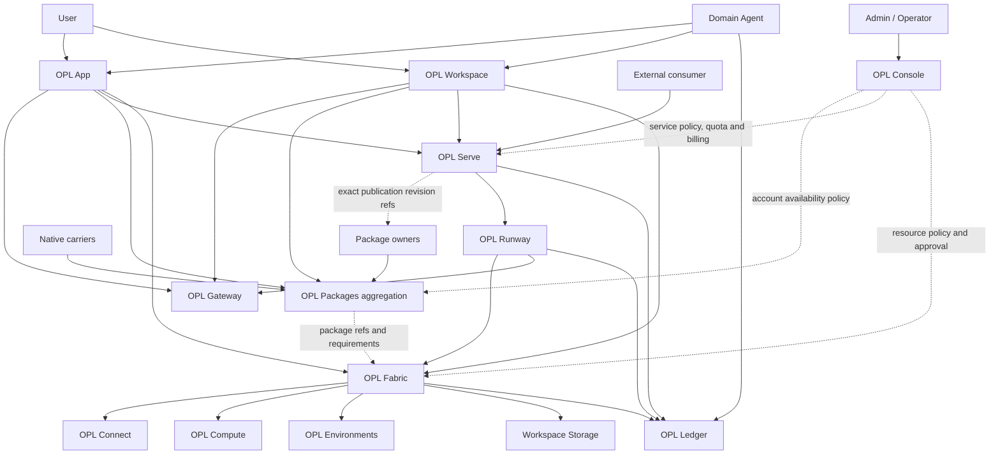

# OPL Cloud Architecture

Owner: `one-person-lab-cloud`
Purpose: `architecture_boundary`
State: `active_target_reference`
Machine boundary: Canonical human-readable target product and authority split.
It does not prove that any listed service, contract, runtime, billing path, or
release is implemented or ready.

OPL Cloud is the target product architecture and implementation-family
navigation surface for extending OPL work from a local App into online
workspaces, account-managed resources and remote execution. This document
defines responsibility boundaries; it does not claim that every service is
currently deployed.

```text
OPL Cloud
├─ OPL Gateway       user-visible AI access, routing and usage
├─ OPL Workspace     user-visible cloud workbench
├─ OPL Serve         Agent API, Embed and Hosted UI publishing
├─ OPL Console       account policy, approval, quota and billing
├─ OPL Fabric        Connect, Compute, Storage, Environments and adapters
└─ OPL Ledger        receipt and provenance refs

Package owners       identity, capabilities, entrypoints and publication revisions
Native carriers      install, update, remove and installed/callable readback

OPL Framework
├─ OPL Packages      discovery, carrier delegation and state aggregation
└─ OPL Runway       invocation, session and execution-provider lifecycle

Domain agents        domain strategy, quality verdict and delivery authority
```

## Repository And Instance Topology

```text
one-person-lab-cloud
  product architecture, whitepaper, roadmap
  Console + Control Plane + Fabric + Ledger implementation
  reusable contracts, images and release mechanisms
        |
        v
opl-instance-medopl
  medopl instance profile, IaC, secret refs, promotion and deployment evidence
```

`one-person-lab-cloud` is the single product and implementation repository.
Console, Control Plane, Fabric, and Ledger remain logical service owners inside
it; similarly named prototype repositories are historical inputs, not parallel
current writers. The short identifier `opl-cloud` remains valid for packages,
images, binaries, services, namespaces, environment variables and runner
labels, but it is not a repository boundary.

An instance repository materializes one installation without copying product or
runtime code. It owns non-secret domains, provider selection, region and
resource profile, enabled plans and prices, image pins, secret references, and
deployment receipts. An instance may run on a hosted cloud, a local server, or
a Mac. Secrets remain in the selected secret owner, never in the instance
repository.



## Surface Roles

| Surface | Owner responsibility | Explicit non-owner boundary |
| --- | --- | --- |
| OPL Gateway | AI access, routing, provider policy and usage signals | Package state and domain quality |
| OPL Workspace | Cloud workbench, project state, artifacts and user-visible status | Package lifecycle and resource truth |
| OPL Serve | Agent Service, immutable Revision, Deployment, endpoint, traffic and Hosted UI projection | Package lifecycle, sandbox internals and domain verdicts |
| OPL Console | Account onboarding, Workspace lifecycle, quota, approval, account-total billing view and managed-resource policy | Spendable wallet, package install/update/repair and resource execution |
| OPL Fabric | Provider-neutral connector, compute, storage and environment capabilities; resource binding and execution adapters | Customer balance, package identity, carrier state and domain verdicts |
| OPL Ledger | Receipt, provenance, review and continuation refs | Source data, package truth and domain verdicts |
| Package owner | Stable identity, capabilities, entrypoints and exact publication revisions | Physical carrier state, Cloud policy and domain verdicts |
| Native carrier | Physical install, update, remove and fresh installed/callable readback | Package identity, Cloud policy and domain verdicts |
| OPL Packages | Carrier-neutral discovery, descriptor projection, configured-carrier delegation and fresh state aggregation | Parallel resolver/lock/currentness, account policy and domain truth |
| OPL Runway | Invocation/session lifecycle and execution-provider routing | Service identity, package lifecycle and domain verdicts |
| Domain agent | Domain strategy, evidence judgment, quality verdict and delivery authority | Cloud infrastructure truth |

## Workspace Identity Boundary

Each user account may own zero or more independent OPL Workspaces. Every
Workspace has its own stable identity, URL, runtime, storage, provider binding,
billing period, credentials, lifecycle, and receipts. OPL Cloud sets no fixed
product-level count limit; balance, provider capacity, quota, and account
policy still govern each creation. Projects, tasks, files, artifacts, and
continuation entries remain inside their selected Workspace and do not become
Workspace identity.

The OPL App active shell provides the browser carrier. External multi-user SaaS
experiments are not Cloud implementation owners or maintenance targets. The
full decision and excluded repositories are recorded in
[Workspace Identity And External SaaS Boundary](workspace-identity-and-external-saas-boundary.md).

Agent Services do not change this identity. Workspaces and Services can both be
zero-to-many per account, but Services remain deployment resources for external
consumers rather than workbench instances.

## Service Publication Boundary

OPL Serve publishes an exact package revision through a dedicated Agent Edge:

```text
Agent Package exact digest
-> Service Entrypoint Contract
-> Agent Service
-> immutable Agent Revision
-> Deployment and traffic policy
-> API / Embed / Hosted UI
-> Invocation or Session
```

The Agent Edge owns public authentication, request validation, rate limits,
quota, routing, event streaming and signed Webhooks. Public traffic does not
terminate at a Workspace, sandbox, container or external provider session.

Runway owns the OPL Invocation and Session lifecycle and routes each exact
revision to an approved execution-provider adapter. The OPL-native Runway/Fabric
path and any external managed-Agent runtime remain adapters; their identifiers
are refs, not OPL Service or Deployment truth.

Hosted UI and Embed clients consume the same Serve API. They may project an
Agent's schemas, events, artifacts and publisher branding, but cannot bypass
Serve authentication, policy, quota or receipts.

## Execution Boundary

OPL App and OPL Workspace use the same resource execution pattern:

```text
plan -> approve -> execute -> monitor -> collect -> receipt
```

Console applies account or explicit shared policy when a workspace, connector
or resource is Cloud-hosted or managed. Fabric performs the approved resource
binding and execution. User-provided local, SSH or HPC resources can use the
same pattern without becoming Console-billed resources by default.

Fabric exposes a provider-neutral capability interface. An instance selects an
approved provider profile, such as `tencent-tke`, `local-docker`, or generic
`kubernetes`. Provider identifiers, diagnostics, retries, and recovery
mutations stay inside the adapter. The Control Plane persists a provider
binding per Workspace and uses one launch/recovery state machine; it does not
hard-code Tencent resource names into product identity.

## Balance And Billing Boundary

Gateway is the only spendable account-balance owner. Console owns the
account-total billing projection, pricing and settlement policy, and initiates
one monthly settlement per Workspace and billing period. Fabric reports
resource/provider facts and owns no wallet or balance. Ledger records
append-only charge, refund, resource, and reconciliation receipts without
becoming a second balance store.

## Package Lifecycle Boundary

There is no Cloud-owned Agent Registry. Package identity, capabilities,
entrypoints and exact publication revisions come from the Package owner.
Physical install/update/remove and installed/callable state come from fresh
readback of the configured native carrier. Framework `opl packages` discovers
descriptors, delegates carrier actions and aggregates those owner/carrier
projections; it is not a second resolver, lock or currentness authority.

Legacy Framework lock, payload, lifecycle-receipt or rollback projections may
remain during migration. Cloud target contracts must not make them a new
consumer or use them as ordinary Package identity, dependency or readiness
gates.

Cloud surfaces consume those refs without redefining them:

- Console projects whether account policy permits a package ref and which
  quotas or managed resources may use it.
- Fabric reads package requirements and binds compute, storage, environments
  and connectors for a run.
- App and Workspace display owner identity plus fresh carrier state and actions
  aggregated by Framework.
- Ledger may record exact publication, carrier-action and carrier-readback refs
  for later review.

None of these projections can install, update, remove, repair or create a
second package or carrier truth. Mutations route to the configured carrier.

## Connector And Domain Boundary

OPL Connect owns stable connector access, normalized source refs, credential
boundaries, errors, retries and rate limits. Domain-specific adapters and
domain agents own retrieval strategy, evidence selection, synthesis and quality
judgment. Ledger records refs only.

The current OPL connector surface and any domain-specific adapter must be read
from fresh Framework/domain contracts and runtime readback. A target connector
described in Cloud docs is not a readiness claim.

## Data Boundary

Cloud stores refs, metadata, lineage, receipts, usage and policy records.
Sensitive source data remains in user workspaces, institutional storage or
private buckets by default. A Cloud receipt points back to the owning source; it
does not become a second source of truth.

External service traffic adds a consumer identity, data classification,
retention, deletion and egress boundary. Serve and Console must resolve those
policies before Runway selects a provider or Fabric binds resources.

## Currentness Boundary

This repository explains the target product split. Service availability comes
from the corresponding implementation repo, API contract, runtime health and
owner receipt. Package currentness comes from the owning publication surface and
fresh native-carrier readback, exposed through Framework aggregation where
available.
Contract presence, documentation, a successful build or an empty queue does not
prove Cloud, package, domain or production readiness.
