# OPL Cloud Architecture Diagram Package

Owner: `one-person-lab-cloud`
Purpose: `approved_architecture_diagram_index`
State: `approved_design_support_detail`

This directory contains the approved OPL Cloud business-driven architecture
views. Each image has one reviewable Mermaid source and one same-named SVG.
These diagrams explain canonical decisions; they do not replace the SSOT owners
listed in `docs/README.md`.

## Diagram Index

| No. | Image name | What the image explains | Canonical owner | Source | Render |
| --- | --- | --- | --- | --- | --- |
| 01 | OPL Cloud 业务上下文与固定输入输出 | Why the product exists, its fixed input/output, and external authorities | `docs/project.md`, `docs/architecture.md` | [Mermaid](./diagrams/01-business-context.mmd) | [SVG](./diagrams/01-business-context.svg) |
| 02 | DDD 限界上下文与模块权威 | Core, supporting, presentation, and external domains | `docs/architecture.md`, `docs/invariants.md` | [Mermaid](./diagrams/02-ddd-bounded-contexts.mmd) | [SVG](./diagrams/02-ddd-bounded-contexts.svg) |
| 03 | 聚合根、数据库与数据权威 | Aggregate boundaries, database ownership, projections, and external truth | `docs/invariants.md`, `docs/implementation-architecture.md` | [Mermaid](./diagrams/03-data-ownership.mmd) | [SVG](./diagrams/03-data-ownership.svg) |
| 04 | Workspace 开通端到端业务时序 | Request order from purchase confirmation to authoritative Workspace readback | Source, contracts, `docs/invariants.md` | [Mermaid](./diagrams/04-workspace-launch-sequence.mmd) | [SVG](./diagrams/04-workspace-launch-sequence.svg) |
| 05 | 外部 Stage 幂等恢复状态机 | How owner readback, mutation reservation, finite budgets, and manual review converge | `docs/invariants.md`, source | [Mermaid](./diagrams/05-stage-recovery-state-machine.mmd) | [SVG](./diagrams/05-stage-recovery-state-machine.svg) |
| 06 | Workspace 完整业务生命周期 | Provisioning, running, renewal, expiry, deletion, and manual review | `docs/architecture.md`, `docs/invariants.md` | [Mermaid](./diagrams/06-workspace-lifecycle.mmd) | [SVG](./diagrams/06-workspace-lifecycle.svg) |
| 07 | Workspace 访问与运行时认证时序 | Account entitlement, Fabric readiness, shared proxy, Runtime auth, and storage access | `docs/implementation-architecture.md` | [Mermaid](./diagrams/07-workspace-access-sequence.mmd) | [SVG](./diagrams/07-workspace-access-sequence.svg) |
| 08 | Workspace 永久删除与零退款链路 | Ordered owner-authoritative absence proof and final deletion Receipt | `docs/invariants.md`, source | [Mermaid](./diagrams/08-workspace-delete-flow.mmd) | [SVG](./diagrams/08-workspace-delete-flow.svg) |
| 09 | 跨 Owner 账务与资源对账闭环 | How Control Plane, Sub2API, Fabric, and Ledger facts become a purchase guard | Billing and evidence contracts, source | [Mermaid](./diagrams/09-billing-reconciliation.mmd) | [SVG](./diagrams/09-billing-reconciliation.svg) |
| 10 | OPL Cloud 运行部署拓扑 | Public entry, internal service network, database isolation, provider boundary, and Runtime | `docs/architecture.md`, deployment assets | [Mermaid](./diagrams/10-runtime-deployment-topology.mmd) | [SVG](./diagrams/10-runtime-deployment-topology.svg) |
| 11 | 运维观测层级与故障响应 | Process, service, product, and business evidence leading to bounded response | Instance owner, `docs/runtime/**` | [Mermaid](./diagrams/11-operations-observability-and-incident-response.mmd) | [SVG](./diagrams/11-operations-observability-and-incident-response.svg) |
| 12 | Candidate 双路径资格与正式产品发布 | Exact SHA/digest qualification, receipts, release admission, and exact-byte promotion | `docs/decisions.md`, `docs/roadmap.md` | [Mermaid](./diagrams/12-candidate-qualification-and-product-release.mmd) | [SVG](./diagrams/12-candidate-qualification-and-product-release.svg) |
| 13 | 业务驱动交付 Roadmap | Outcome-based milestones from architecture baseline through Workspace Core and later Serve | `docs/roadmap.md` | [Mermaid](./diagrams/13-business-driven-delivery-roadmap.mmd) | [SVG](./diagrams/13-business-driven-delivery-roadmap.svg) |
| 14 | Tencent/TKE 产品链完成度与 Owner 总览 | Current evidence level, responsibility, gap, and next evidence for each TKE-facing capability | Source, `docs/status.md`, `docs/roadmap.md`, Instance owner | [Mermaid](./diagrams/14-tencent-tke-completion-overview.mmd) | [SVG](./diagrams/14-tencent-tke-completion-overview.svg) |
| 15 | Tencent/TKE Workspace Launch 持久化业务链 | What each owner persists before mutation and which readback permits stage progression | Source, schemas, `docs/invariants.md` | [Mermaid](./diagrams/15-tencent-tke-launch-persistence-chain.mmd) | [SVG](./diagrams/15-tencent-tke-launch-persistence-chain.svg) |
| 16 | Tencent/TKE 恢复、删除与对账收敛 | How uncertain results, permanent Delete, and cross-owner reconciliation converge | Source, `docs/invariants.md`, `docs/roadmap.md` | [Mermaid](./diagrams/16-tencent-tke-recovery-delete-reconciliation.mmd) | [SVG](./diagrams/16-tencent-tke-recovery-delete-reconciliation.svg) |
| 17 | Tencent/TKE Candidate 到 Release 证据链 | Which exact-identity receipts are still required before current bytes can become a formal Release | `docs/status.md`, `docs/roadmap.md`, Instance owner | [Mermaid](./diagrams/17-tencent-tke-candidate-release-evidence-chain.mmd) | [SVG](./diagrams/17-tencent-tke-candidate-release-evidence-chain.svg) |

## Reading Order

1. Read diagrams 01-03 to understand product, domain, and data boundaries.
2. Read diagrams 04-09 to understand customer commands and lifecycle behavior.
3. Read diagrams 10-12 to understand deployment, operations, and publication.
4. Read diagram 13 as a projection of the canonical roadmap, not a second gap owner.
5. Read diagrams 14-17 when reviewing the current product from the Tencent/TKE
   extension perspective. These are completion overlays, not target-architecture
   replacements.

## Completion Evidence Legend

The completion overlays use evidence levels instead of subjective percentages:

| Level | Meaning |
| --- | --- |
| `TARGET` | Target is defined; no current implementation claim |
| `SOURCE` | Current source, schema, and focused tests implement the capability |
| `LOCAL` | Retained local runtime evidence exists for the named identity |
| `CANDIDATE` | One exact SHA and multi-architecture digest passed qualification |
| `INSTANCE` | The Instance owner deployed and authoritatively read back that identity |
| `RELEASED` | The same qualified bytes were formally published |
| `BLOCKED` | A named gap or higher-layer owner receipt is missing |
| `LATER` | Outside the current Workspace Release |

Canonical current-document conflicts must be reconciled in their owner before
the overlay is finalized; the diagram package does not retain a parallel
`SSOT_REVIEW` conclusion. Evidence never upgrades implicitly. In particular,
Tencent adapter source and tests do not prove a TKE Instance deployment, and an
old Candidate receipt does not qualify the current Candidate.

## Render Rules

- Mermaid sources are the reviewable diagram definitions.
- SVG files are generated views and must keep the same base name as the source.
- Image titles state the question answered by the diagram.
- A diagram cannot prove implementation, runtime, Instance, or production state.
- Changes to target intent must first reconcile the canonical topic owner.
- Changes to current facts or gaps must first reconcile `docs/status.md` or
  `docs/roadmap.md`, respectively.

## Gallery

### 01. OPL Cloud 业务上下文与固定输入输出


### 02. DDD 限界上下文与模块权威


### 03. 聚合根、数据库与数据权威


### 04. Workspace 开通端到端业务时序

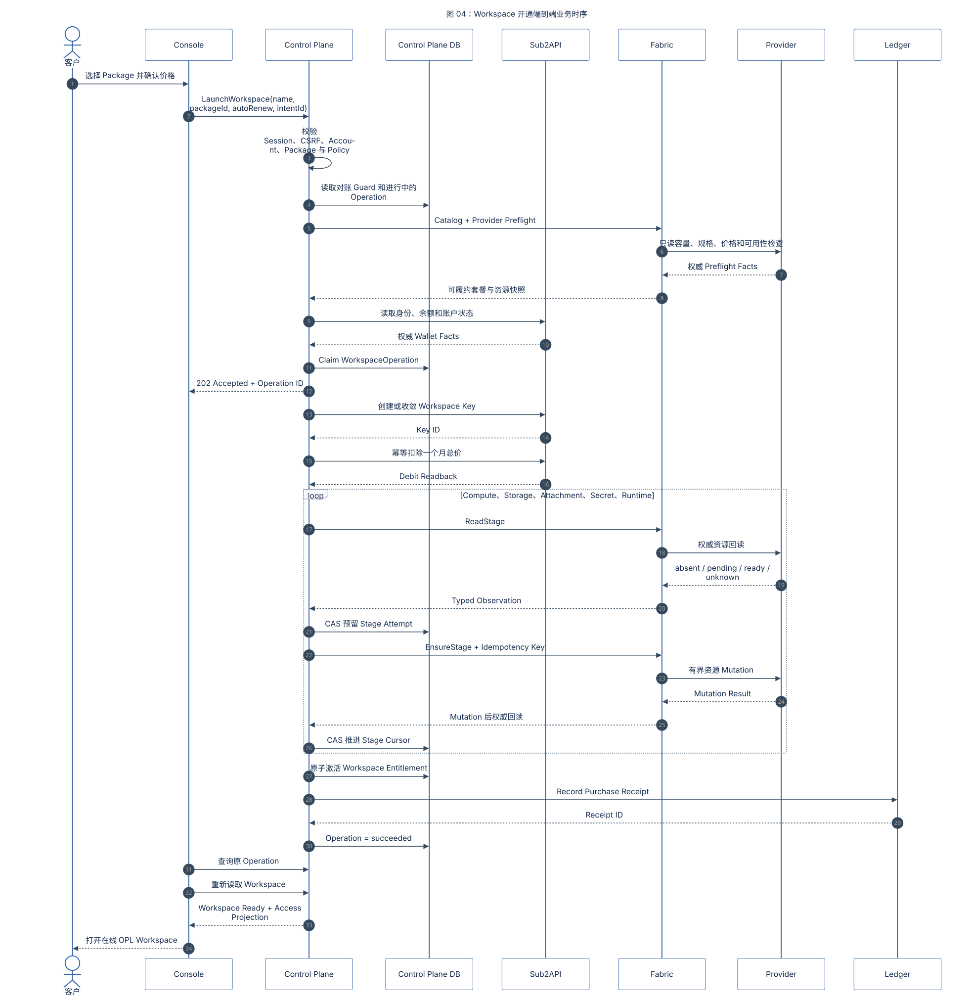

### 05. 外部 Stage 幂等恢复状态机


### 06. Workspace 完整业务生命周期


### 07. Workspace 访问与运行时认证时序

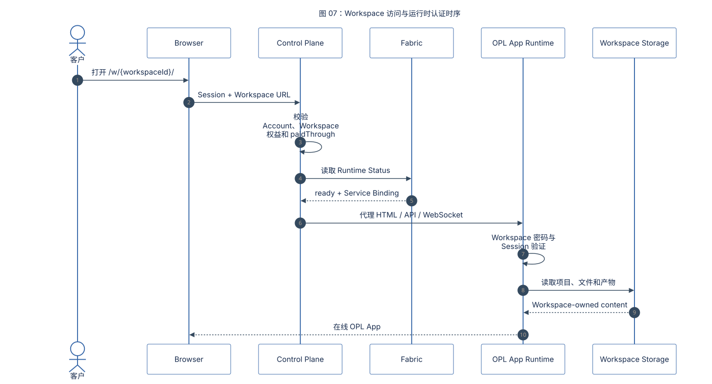

### 08. Workspace 永久删除与零退款链路


### 09. 跨 Owner 账务与资源对账闭环


### 10. OPL Cloud 运行部署拓扑


### 11. 运维观测层级与故障响应


### 12. Candidate 双路径资格与正式产品发布


### 13. 业务驱动交付 Roadmap


### 14. Tencent/TKE 产品链完成度与 Owner 总览


### 15. Tencent/TKE Workspace Launch 持久化业务链


### 16. Tencent/TKE 恢复、删除与对账收敛


### 17. Tencent/TKE Candidate 到 Release 证据链

